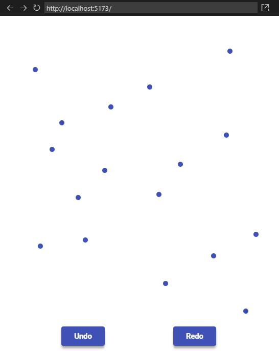

<h1 align="center"> React Challenge 01 </h1>

O desafio foi proposto pelo Fernando Ferrari do canal do Youtube <a href="https://www.youtube.com/@fernandev1/">@Fernandev</a> e esse é o primeiro desafio da série “Desafio ReactJs de entrevista” .

<strong>
<a href="https://www.youtube.com/watch?v=qmZLWBOOfVQ&t=1247s">Vídeo do desafio</a>
</strong>

<iframe width="460" height="215" src="https://www.youtube.com/embed/qmZLWBOOfVQ?controls=0" title="YouTube video player" frameborder="0" allow="accelerometer; autoplay; clipboard-write; encrypted-media; gyroscope; picture-in-picture; web-share" allowfullscreen></iframe>

 
 

  <a href="#-tecnologias">Tecnologias</a>&nbsp;&nbsp;&nbsp;|&nbsp;&nbsp;&nbsp;
  <a href="#-projeto">Desafio do projeto</a>&nbsp;&nbsp;&nbsp;|&nbsp;&nbsp;&nbsp;
  <a href="#memo-licença">Licença</a>

  

## 🚀 Tecnologias

##### Esse projeto foi desenvolvido com vários conceitos e tecnologias, mas as principais são:

- [Vite](https://vitejs.dev/)
- [ReactJS](https://reactjs.org/)

## 💻 Desafio do projeto

##### Desenvolva uma aplicação em que:

- O usuário pode clicar em qualquer lugar da página.
- Deve-se renderizar um pequeno círculo na posição do clicada.
- A cada clique, mantém-se os círculos já criados e renderiza-se un novo.
- Crie duas funcionalidades para a aplicação:
  - desfazer (undo)
  - refazer (redo)

    

 

    <a href="">🖥️ Acesso o projeto publicado 🖥️</a>

## :memo: Licença

##### Esse projeto está sob a licença MIT.

---

Feito com ♥ by Cristhian Santos
